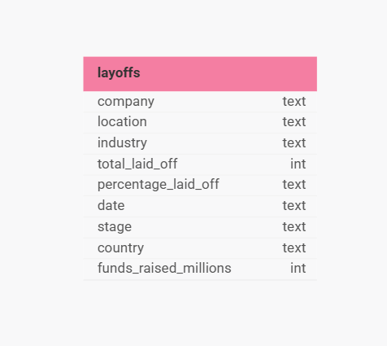
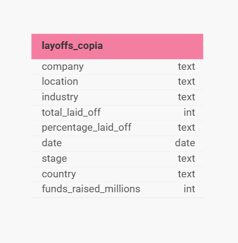

# Data Cleaning em SQL — Layoffs Dataset

Este script tem como objetivo demonstrar o processo completo de **limpeza, padronização e preparação de dados** utilizando **MySQL**.  
O dataset utilizado contém informações sobre **demissões em empresas de tecnologia**, e o script realiza etapas essenciais de *data cleaning* para torná-lo pronto para análise.

## Sobre o Banco de Dados
Destaca-se que os dados foram fornecidos através de um arquivo CSV, o qual apresentou um banco de dados simples composto por uma única tabela, referente aos layoffs em empresas de vários setores. 

Ademais, apresenta-se abaixo um diagrama da tabela e seus atributos antes e depois das operações realizadas no script.

  <figure>
    
  </figure>
  <figure>
    
  </figure>

Cabe mencionar que as alterações realizadas no banco não são muito aparentes à primeira vista, pois não foi necessário uma reestruturação completa dos metadados. A principal mudança ocorreu em apenas um dos atributos da tabela, que precisou ser ajustado para refletir corretamente o tipo de dado utilizado no projeto. Porém a limpeza e padronização realizada pode ser vista mais a fundo comparando os arquivos [layoffs](/data-cleaning-layoffs/layoffs.csv) e [layoffs_copia](/data-cleaning-layoffs/layoffs_copia.csv).

##  Sobre o Script

O script SQL aplica boas práticas de tratamento de dados, incluindo:

- Criação de cópias da tabela original para preservar o dataset original.  
- **Remoção de duplicatas** com funções de janela (`ROW_NUMBER`).  
- **Padronização de texto** e tratamento de inconsistências.  
- **Conversão de tipos de dados**, especialmente campos de data.  
- **Preenchimento de valores ausentes** e eliminação de registros inválidos.  

O resultado [layoffs_copia](/data-cleaning-layoffs/layoffs_copia.csv) é um conjunto de dados limpo, padronizado e pronto para uso em análises, dashboards ou pipelines ETL.

## Tecnologias Utilizadas

- **MySQL**  

